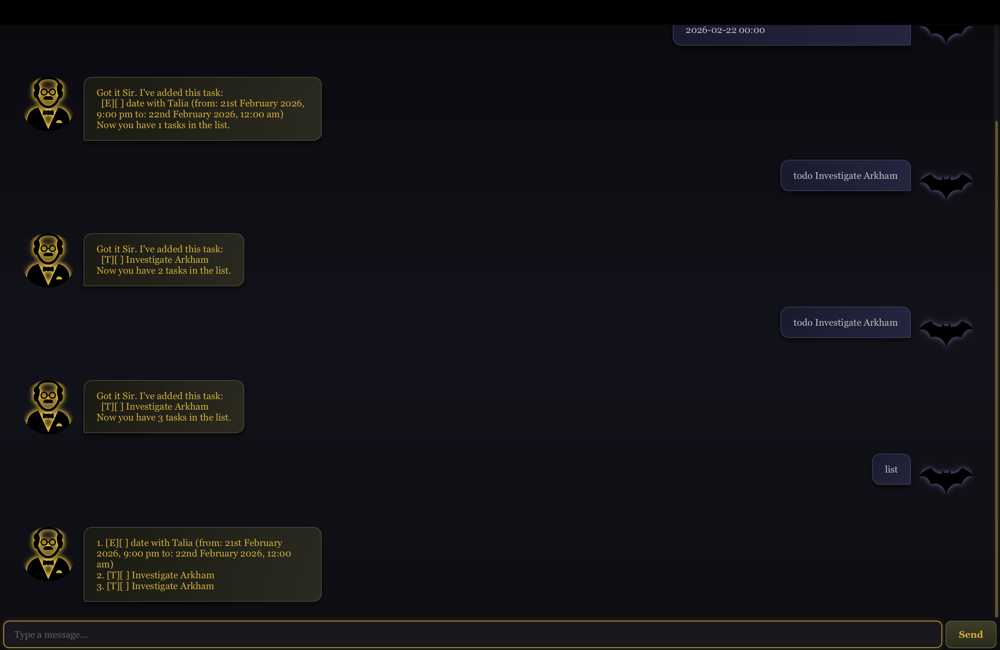

# Alfred User Guide
Why do we fall Master Wayne? So we can learn to pick ourselves up!


Alfred is your personal task management butler, designed to help you keep track of your todos, deadlines, and events with ease as you fight on the streets of Gotham.

---

## Table of Contents
- [Quick Start](#quick-start)
- [Features](#features)
    - [Adding a Todo](#adding-a-todo-todo)
    - [Adding a Deadline](#adding-a-deadline-deadline)
    - [Adding an Event](#adding-an-event-event)
    - [Listing Tasks](#listing-tasks-list)
    - [Marking a Task](#marking-a-task-mark)
    - [Unmarking a Task](#unmarking-a-task-unmark)
    - [Deleting a Task](#deleting-a-task-delete)
    - [Finding Tasks](#finding-tasks-find)
    - [Adding Notes](#adding-notes-note)
    - [Exiting](#exiting-bye)
- [Date and Time Formats](#date-and-time-formats)
- [Data Storage](#data-storage)
- [Command Summary](#command-summary)

---

## Quick Start

1. Ensure you have **Java 17** or above installed on your computer
2. Download the latest `alfred.jar` from the [releases page](../../releases)
3. Copy the file to the folder you want to use as the home folder for Alfred
4. Double-click the file or run `java -jar alfred.jar` in your terminal
5. A GUI window should appear with a welcome message from Alfred
6. Type commands in the text box and press Enter or click Send

---

## Features

### Adding a Todo: `todo`

Adds a simple task without any date/time.

**Format:** `todo <description>`

**Example:**
```
todo investigate Arkham
```

**Expected output:**
```
Very Good Sir, I've added this task:
  [T][ ] investigate Arkham
Now you have 1 tasks in the list.
```

---

### Adding a Deadline: `deadline`

Adds a task with a due date (and optional time).

**Format:** `deadline <description> /by <date> [time]`

- Date format: `yyyy-MM-dd` (e.g., `2024-01-27`)
- Time format (optional): `HH:mm` (e.g., `14:00`)

**Examples:**
```
deadline disable Joker's bomb /by 2024-01-27
deadline assasinate Robin /by 2024-01-27 14:00
```

**Expected output:**
```
Very Good Sir, I've added this task:
  [D][ ] disable Joker's bomb (by: 27th January 2024)
Now you have 2 tasks in the list.
```

---

### Adding an Event: `event`

Adds a task with a start and end date/time.

**Format:** `event <description> /from <date> [time] /to <date> [time]`

**Examples:**
```
event date with Talia /from 2024-01-27 /to 2024-01-29
event Wayne Enterprises meeting /from 2024-01-27 14:00 /to 2024-01-27 16:00
```

**Expected output:**
```
Got it. I've added this task:
  [E][ ] date with Talia (from: 27th January 2024 to: 29th January 2024)
Now you have 3 tasks in the list.
```

> ⚠️ **Note:** Both `/from` and `/to` must use the same format (both date-only OR both date+time).

---

### Listing Tasks: `list`

Shows all tasks in your list.

**Format:** `list`

**Expected output:**
```
1. [T][ ] investigate Arkham
2. [D][ ] disable Joker's bomb (by: 27th January 2024)
3. [E][ ] date with Talia (from: 27th January 2024 to: 29th January 2024)
```

---

### Marking a Task: `mark`

Marks a task as completed.

**Format:** `mark <task number>`

**Example:**
```
mark 1
```

**Expected output:**
```
Very Good Sir, I've marked this task as done:
  [T][X] investigate Arkham
```

---

### Unmarking a Task: `unmark`

Marks a task as not completed.

**Format:** `unmark <task number>`

**Example:**
```
unmark 1
```

**Expected output:**
```
Very Good Sir, I've marked this task as not done yet:
  [T][ ] investigate Arkham
```

---

### Deleting a Task: `delete`

Removes a task from the list.

**Format:** `delete <task number>`

**Example:**
```
delete 2
```

**Expected output:**
```
Noted. I've removed this task:
  [D][ ] disable Joker's bomb (by: 27th January 2024)
Now you have 2 tasks in the list.
```

---

### Finding Tasks: `find`

Searches for tasks containing a keyword.

**Format:** `find <keyword>`

**Example:**
```
find Arkham
```

**Expected output:**
```
Here are the matching tasks in your list, Sir:
1. [T][ ] investigate Arkham
```

---

### Adding Notes: `note`

Adds a note to an existing task.

**Format:** `note <task number> <note text>`

**Example:**
```
note 1 meetup with Gordon
```

**Expected output:**
```
Very Good Sir, I've added a note to this task:
  [T][ ] investigate Arkham
   Notes: meetup with Gordon
```

---

### Exiting: `bye`

Exits the application. Your tasks are automatically saved.

**Format:** `bye`

**Expected output:**
```
Goodbye Sir, Happy Hunting!
```

The application will close after 1.5 seconds.

---

## Date and Time Formats

| Type | Format | Example |
|------|--------|---------|
| Date only | `yyyy-MM-dd` | `2024-01-27` |
| Date and time | `yyyy-MM-dd HH:mm` | `2024-01-27 14:00` |

Dates are displayed in proper English format:
- `27th January 2024`
- `1st February 2024, 2:00 PM`
- `3rd March 2024`

---

## Data Storage

- Tasks are saved automatically in `./data/alfred.txt`
- The file is created automatically when you add your first task
- Do not edit this file manually unless you know what you're doing

---

## Command Summary

| Action | Format |
|--------|--------|
| Add todo | `todo <description>` |
| Add deadline | `deadline <description> /by <date> [time]` |
| Add event | `event <description> /from <date> [time] /to <date> [time]` |
| List tasks | `list` |
| Mark done | `mark <number>` |
| Unmark | `unmark <number>` |
| Delete | `delete <number>` |
| Find | `find <keyword>` |
| Add note | `note <number> <text>` |
| Exit | `bye` |

## Acknowledgements

- UI design inspiration adapted from [AK-matrix/ip](https://github.com/AK-matrix/ip)
- [Butler icons](https://www.flaticon.com/free-icons/butler) created by Freepik - Flaticon
- [Bat icons](https://www.flaticon.com/free-icons/bat) created by Freepik - Flaticon

